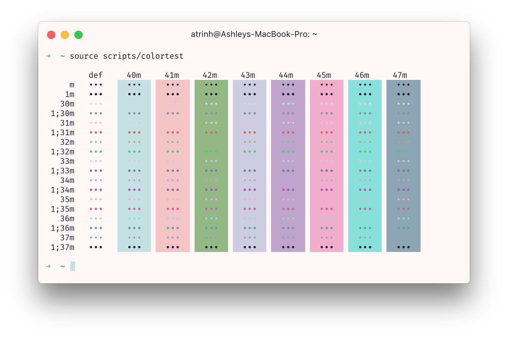

# hyper-teatime
A cute theme for [Hyper.app](https://hyper.is) with pastel colors :3

### installation
In your `.hyper.js` add package name to your plugins array:

  ```js
  plugins: [
    'hyper-teatime',
  ],
  ```
